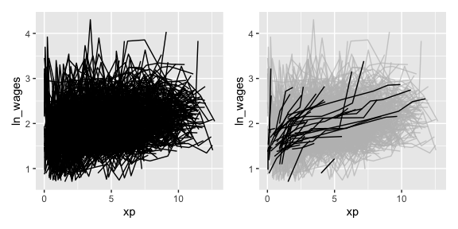
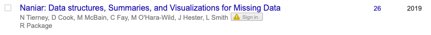
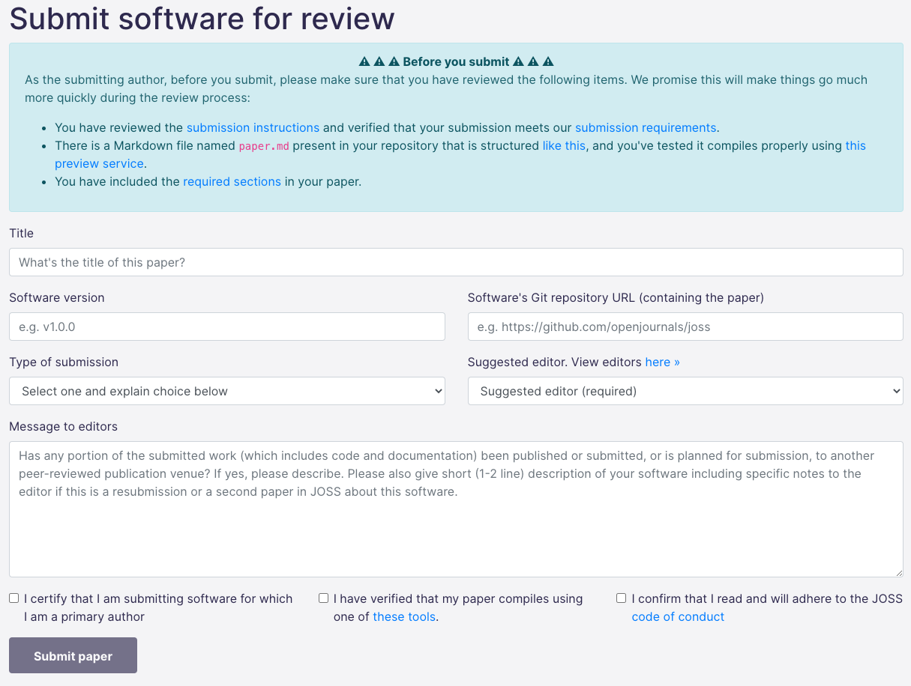

layout: true
<div class="my-footer"><span>bit.ly/LINK • @nj_tierney</span></div> 

```{r setup, include=FALSE}
# options(htmltools.dir.version = FALSE, width = 120)
# NOTE TO SELF: The CSS styles were created in `create-njt-theme.R`
knitr::opts_chunk$set(
  fig.path = "figures/",
  cache.path = "cache/",
  fig.align = "center",
  fig.width = 13,
  fig.height = 6,
  fig.retina = 3,
  fig.show = "hold",
  external = TRUE,
  # dev = "svglite",
  # dev.args = list(bg = "transparent"),
  message = FALSE,
  warning = FALSE,
  cache = FALSE,
  echo = TRUE,
  autodep = TRUE
)
```

```{r library, include = FALSE, echo = FALSE}
library(tidyverse)
library(visdat)
library(naniar)
library(gganimate)
library(knitr)
library(ggrepel)
library(leaflet)
```


```{r read-tb, echo = FALSE, cache = TRUE}
tb <- read_csv(here::here("slides",
                          "data",
                          "TB_notifications_2018-03-18.csv.gz")) %>% 
  select(country, 
         iso3, 
         year, 
         new_sp_m04:new_sp_fu) %>%
  gather(key = stuff, 
         value = count, 
         new_sp_m04:new_sp_fu) %>%
  separate(col = stuff, 
           into = c("stuff1", 
                    "stuff2", 
                    "genderage")) %>%
  select(-stuff1, 
         -stuff2) %>%
  mutate(gender = str_sub(genderage, 1, 1), 
         age = str_sub(genderage, 2, length(genderage))) %>%
  select(-genderage) %>%
  filter(!(age %in% c("04", "014", "514", "u"))) %>%
  filter(year > 1996, 
         year < 2013)
  
tb_au <- tb %>% 
  filter(country == "Australia")  %>%
mutate(age =
  case_when(age == "1524" ~ "15-24",
            age == "2534" ~ "25-34",
            age == "3544" ~ "35-44",
            age == "4554" ~ "45-54",
            age == "5564" ~ "55-64",
            age == "65" ~ "65+"))
```


```{r helpers, include=FALSE}
theme_set(
  theme_grey(base_size = 16) +
  theme(
    legend.position = "bottom",
    plot.background = element_rect(fill = "transparent"),
    legend.background = element_rect(fill = "transparent")
  )
)

# **ni**ck's **pa**lette
nipa <- list(red = "#c03018",
             orange = "#f0a800",
             green = "#609048",
             purple = "#484878",
             light_purple = "#A3A3BB",
             light_green = "#AFC7A3",
             light_orange = "#F7D37F",
             light_red = "#DF978B",
             pale_purple = "#ECECF1",
             pale_green = "#D7E3D1",
             pale_orange = "#FBE9BF",
             pale_red = "#EFCBC4")


as_table <- function(...) knitr::kable(..., format='html', digits = 3)
```


???

Main arguments of the talk:

- We need software to do research
- Writing research software is a research contribution
- Research software is critically under-funded and not acknowledged. 
- We will continue to lose software developers if they are not acknowledged.
- We must fund and acknowledge software
- What does a research software engineer do?
- The history of research software in academia
- What I do in a day to day role
- What Academia, and you, can do to help

I'll discuss why we need to consider software as academic output,
what a research software engineer does, how I work in a team of researchers, 
and some of the practices I have put in place to maintain reproducibility. 


---
class: inverse, middle, center

# Your Turn: What software do people use in their research?


---
class: inverse, middle, center

# Your Turn: Has anyone written software for their research and released it into the wild?

---
class: inverse, middle, center

# Your Turn: Could you do your research without software?

???

(R, Matlab, C, FORTRAN)

---
class: inverse, middle, center

# Do we need software to do our research?

---

# Imaging a black hole 

---

# COVID19

- Doherty Report

---

# COVID19

  - Grattan Institute vis
  
---

# COVID19

  - Casey Briggs / ABC data vis

---
class: center, inverse-orange, middle
# Premise 1: Writing research software is a research contribution

---

```{r create-lm-data, echo = FALSE}
n <- 100
x <- rnorm(n)
z <- rep(1:3, length.out = n)
y <- rnorm(n)
```


# Functions are tools to help us manage complexity

For example: R's model syntax 

Using existing base R functions:

```{r lm-fit}
fit <- lm(y ~ x + factor(z))
coef(fit)
fit |> resid() |> summary()
```


---

# Functions are tools to help us manage complexity

Versus writing a model from scratch

```{r old-school-fit}
X <- cbind(1, x, z == 2, z == 3)
fit <- solve(t(X) %*% X) %*% t(X) %*% y
fit
# ugh, residuals...
```

???

(which is actually a syntactic algebra from a paper ... (heard via Emi Tanaka))

---

# Functions are tools to help us manage complexity

.left-code[
```{r leaflet-example, eval = FALSE, echo = TRUE}
leaflet() %>%
  addTiles() %>%  
  addMarkers(
    lng = 174.768, 
    lat = -36.852, 
    popup = "R's birthplace"
  )
```
]

.right-plot[
```{r leaflet-example-out, ref.label="leaflet-example", echo = FALSE}
```
]

---
# Functions allow you to abstract complexity so you can individually reason with them

- Assembly --> C --> R --> ggplot

---
# Abstraction of complexity: similarities between software and maths

> Users often remark on the ease of  manipulating data with dplyr and it is natural to wonder if perhaps the task itself is trivial.  We claim it is not. Many probability challenges become dramatically easier, once you strike  upon the "right" notation. In both cases, what feels like a matter of notation or syntax is really more about **exploiting the "right" abstraction**.

-- Jenny Bryan & Hadley Wickham  "Data  Science:  A  Three  Ring  Circus  or  a  Big  Tent?"

???

This means that it is not just statistical models, but things like dplyr, ggplot


---
# Abstraction of complexity: similarities between software and maths

Notation matters!

--

.large[
$1000000$ vs $1,000,000$ vs $10^6$
]

--

.large[
$1000000 * 10000 * 10000000 * 10000 = ?$
]

--

.large[
$10^6 * 10^4 * 10^7 * 10^4 = 10^{6 + 4 + 7 + 4}$
]

---
# Abstraction of complexity: similarities between software and maths

"Unmasking the theta method" -- Rob Hyndmand & Baki Billah

> The "Theta method" of forecasting performed particularly well in the M3-
competition and is therefore of interest to forecast practitioners. The original description
of the method given by Assimakopoulos and Nikolopoulos (2000) involves **several pages**
of algebraic manipulation. We show that the method can be expressed much more
simply and that the forecasts obtained are equivalent to simple exponential smoothing
with drift.
  

---
class: inverse-orange, middle, centre
# Premise 2: Research software is critically underfunded and not acknowledged. 

???

# We continue to lose people

---
class: inverse, middle, centre

.huge[
> Every great open source math library is built on the ashes of someone's academic career
]

---

# Travis Oliphant

- PhD 2001 from Mayo Clinic in Biomedical Engineering
- MS/BS in Elec. Comp. Engineering
- Creator of **`SciPy`**, Author of **`NumPy`** ([The _most_ imported machine learning projects on GitHub](https://venturebeat.com/2019/01/24/github-numpy-and-scipy-are-the-most-popular-packages-for-machine-learning-projects/))
- Founding chair of Numfocus / PyData
- Professor at Brigham Young University (2001-2007)
- Applied for tenure

--

- **Application for Tenure was denied. Software wasn't counted**.


(Abbreviated from [William Stein's talk](https://wstein.org/talks/2016-06-sage-bp/bp.pdf))

???

Also worth noting that he has had a successful career from here, his company, 
Continuum Analytics received 24 million dollars in Seris A funding.

---
# Jack Poulson

> Hi William,


> I am sitting on an offer from Google and am increasingly frustrated by 
continual evidence that **it is more valuable to publish a litany of
computational papers with no source code than to do the thankless task of
developing a niche open source library**. Deep mathematical software is
not appreciated by either the mathematicians or the public.
I had been on the fence about accepting the offer, and this conversation
led to me making the difficult decision.

> – [Jack Poulson, Stanford](https://hodgestar.com/jack.html)

(Abbreviated from [William Stein's talk](https://wstein.org/talks/2016-06-sage-bp/bp.pdf))

???

It should be noted that Jack appears to be doing well, had a successful career at Google
and has his own company, [HodgeStar](https://hodgestar.com/jack.html)

---
# "The Astropy problem" ([paper](https://arxiv.org/pdf/1610.03159.pdf))

> "[Astropy is] a community effort to develop a single core package for Astronomy in Python and foster interoperability between Python astronomy packages." 

--

> For **five years** this project has been managed, written, and operated as a grassroots, self-organized, **almost entirely volunteer effort** while the software is used by the majority of the astronomical community. 

--

> Despite this, the project has always been and remains to this day **effectively unfunded** . Further, contributors receive **little or no formal recognition** for creating and supporting what is now critical software. 

---
# Could grant bodies fund Astropy? 

--

>  ..."the NSF hasn’t funded software development for many years now, yet software continues to be written, so...?" 

--

> "[The NSF] would consider funding software, but only once it has reached the point where it’s very mature and has a large number of users." 

--

> These opinions reflect a gross misunderstanding of the amount of time, effort, and expertise it takes to develop software, let alone specialized, scientific software.

---
# OK, but how important is astropy?

--

> ... All NASA mission pipelines... [such as the]... venerable Hubble Space Telescope to the upcoming Nancy Grace Roman Space Telescope, use Astropy.

--

*gif - oh, god*

---

# "The astropy problem": 'Software just, "happens"'

> For much of the community, software is something that just "happens" and is expected to be free. 

--

> However, there is a cost and it is clear who is paying it. 

--

> The early career astronomers who contribute the lion’s share of the effort do so at the expense of their research and publication output.

---

# Francois Chollet

Creator of Keras

---
# Who is funding scientific software?

- TensorFlow (Google)
- Torch (Facebook)
- Keras (Google)


???


---
# What happens if you don't fund software: Heartbleed OpenSSL bug


---
# What happens if you don't fund software: Elemental

[`elemental`](https://github.com/elemental/Elemental) C++ library for distributed-memory dense and sparse-direct linear algebra, conic optimization, and lattice reduction

---
# What happens if you don't fund software: LaplacesDemon

---
# Research can be "done".

--

.pull-left[

Research:

- 3 year research plan
- Survey population
- Get + share data
- Develop model, write about insights
- Submit paper
- reject/revise/publish
- paper published
- That component is done

]

--

.pull-right[
Software:

- 3 years of funding
- Create software to perform modelling
- Develop tests, documentation, examples
- Extend to other niche use cases
- Add features requested by community
- Ongoing maintenance

]

---
# What happens if you don't fund software?

We rebuild the wheel

--

But can we 

---
class: inverse-orange, middle, center
# Can we at least give software developers in academia a name?

-- 

# A research software engineer!

---
# A not-so-brief history of Research Software Engineers (Abridged)

(From the [eponymous paper](https://www.software.ac.uk/blog/2016-08-17-not-so-brief-history-research-software-engineers-0))

> Many academics were aware of the importance of software to research; they could see that the people who created this software went largely unrecognised, and they were beginning to worry about the consequences of this oversight. What happens when something is so vital to research, yet overlooked and severely under-resourced? 


---
# Define: Research Software Engineer

> A Research Software Engineer (RSE) combines professional software engineering expertise with an intimate understanding of research.

-- (from https://society-rse.org/about/)

--

> The Society of Research Software Engineering was founded on the belief that a world which relies on software must recognise the people who develop it.


---
# Research software engineer != Software Engineer

Researcher: create statistical model of malaria for given region

--

Software engineer: Take existing code base, and productionise in containers to run on the web

--

Research software engineer: Identify abstractions, build code that lets researchers write code that lets them focus on their models 

--

Example of this later


---
# What sorts of things does an RSE do?

- Develop tools that abstract the right components 
- Help researchers to find and learn good tools
- Support researchers with (computational) reproducibility
- Support in creating software to solve research problems.

(from Heidi Seibold's [UseR2021 Keynote talk](https://docs.google.com/presentation/d/1XQc2U2X8hiK43UzUi9IwvsvULxhVy0WzWSa_Kt4ZJv4/view#slide=id.gdbfb32d486_0_448))


---
# My journey into the RSE world

- 2008-2012:  Undergraduate + honours in Psychology
- 2013 - 2017: PhD Statistics (EDA + Bayes)
- 2018 - 2020: Research Fellow / Lecturer at Monash
  - Design and improve tools for (exploratory) data analysis
  - Teach introduction to data analysis (ETC1010)

---
    
# EDA: Exploratory Data Analysis

.large[
> ...EDA is an approach to analyzing data sets to summarize their main characteristics, often with visual methods. (Wikipedia)

John Tukey, Frederick Mosteller, Bill Cleveland, Dianne Cook, Heike Hoffman, Rob Hyndman, Hadley Wickham
]

---

# EDA: Why it's worth it

```{r dino-saurus, echo = FALSE}
include_graphics("gifs/dino-saurus.gif")
```

-- From ["Same Stats, Different Graphs: Generating Datasets with Varied Appearance and Identical Statistics through Simulated Annealing"](https://www.autodeskresearch.com/publications/samestats)

---

## `visdat::vis_dat(airquality)`

```{r show-visdat, fig.height = 3.5, fig.width = 8, out.width = "150%", echo = FALSE}
vis_dat(airquality)
```

---

## `naniar::gg_miss_var(airquality)`

```{r gg-miss-var, fig.height = 3.5, fig.width = 8, out.width = "150%", echo = FALSE}
gg_miss_var(airquality)
```

---

## `brolgar`

```{r echo = FALSE}

```

---
class: inverse, middle, center
# What do I do as an RSE?

---

# {greta}

.pull-left[

]

.pull-right[

]

---

# Malaria modelling

- {`yahtsee`} (Yet Another Hierarchical Time Series Extension + Expansion)

```r
m <- fit_hts(
  formula = pr ~ avg_lower_age + hts(who_region, who_subregion, country),
  .data = malaria_africa_ts,
  family = "gaussian"
)
```

--

Instead of...

---

# Malaria modelling


---

# Malaria modelling

---

# Malaria modelling

```r
inlabru::bru(
formula = pr ~ avg_lower_age + Intercept + 
  who_region(month_num, 
             model = "ar1", 
             group = .who_region_id,
             constr = FALSE) + 
  who_subregion(month_num, 
                model = "ar1", 
                group = .who_subregion_id, 
                constr = FALSE) + 
  country(month_num, 
          model = "ar1", 
          group = .country_id, 
          constr = FALSE),
    family = "gaussian",
    data = malaria_africa_ts,
    options = list(
      control.compute = list(config = TRUE),
      control.predictor = list(compute = TRUE, link = 1)
      )
      )
```


---
# Contact matrices

- {`conmat`}

- facilitates fitting


---
# Covid19 modelling

- Establishing reproducible pipelines using `targets`
- Facilitating and performing code review of COVID modelling
- Helping contributes mesh together

???

- RSEs can make research more producctive

---
# RSEs are everywhere!

- A lot of people have been doing this for a long time, it isn't necessarily new,
but providing a name gives us something to rally behind

---
class: inverse, middle, centre

# Getting credit for software

---
# Getting credit for software

- Citations are one form of credit
- Google scholar now picks up R packages on CRAN

```{r}

```

- Reference R monthly R package downloads with a badge:

[](https://CRAN.R-project.org/package=naniar)

- From a university/grant writing/job application perspective:
  - Papers (unfortunately) generally count for more beans more than software
  - Although not strictly true as Monash has recently changed this.

---

# Publishing software as a paper

Statistical methods:

- Create a new method
- Write code to implement the new method
- Ensure code is easy to use for other people
- Write documentation for the software
- Write tests to ensure the software works
- Write a paper about the new method, which links the paper to the method, to the software
- The reviewers review the paper
  - They typically do not review the software or code

You might submit to:

- Journal of Statistical Software
- ...
- Journal of Open Research Software
- The R Journal

---

# Publishing software as a paper: some issues

You are writing **many times**:

1. Write the method
2. Write the code
3. Iterate on the code interface
4. Write the tests
5. Documentation
6. Then an entire paper

Not guaranteed that your code is reviewed

---

# Publishing software as a paper: JOSS

Journal of Open Source Software

- Write the code, tests, documentation
- Provide a short 1-2 page abstract.
- The code gets reviewed
- Changes made
- Paper gets accepted
- DOI minted
- Your software is now citable!

The paper provides a link to the software. It means the person can write
software and not need to write an entire large paper.

---
# JOSS Submission page

```{r joss-submission, echo = FALSE}

```

---
# JOSS Review process

- [Guided walk through](https://github.com/openjournals/joss-reviews/issues)

---
# rOpenSci Software Review

- More in depth software review backed by their [developer guide](https://devguide.ropensci.org/)
- Details on how to review + more [here](https://ropensci.org/software-review/)
- [Guided walk through](https://github.com/ropensci/software-review/issues)

---
# rOpenSci Statistical Software Review

- Expand the rOpenSci software review to [statistics](https://ropensci.org/stat-software-review/)
- [Guide to statistical software peer review](https://stats-devguide.ropensci.org/)

---

# Getting credit: Awards

- John Chambers Award
- Di Cook Award for statistical Software (Vic + Tasmania)
- [ARDS: A national agenda for research software](https://zenodo.org/record/4940274)


--- 
# Changing the values within academia

---

# Take homes

- Writing software is a legitimate form of research contribution
- We need to think about how we fund and support those who write software
- RSEs can help make researchers more productive

---

# Thanks

.large.pull-left[
- Nick Golding
- Tasmin Symons
- Miles McBain
- Karthik Ram
]

.large.pull-right[
- Di Cook
- Rob Hyndman
]

---

# Resources

.large[
- [Data  Science:  A  Three  Ring  Circus  or  a  Big  Tent?](https://arxiv.org/pdf/1712.07349.pdf)
- [A National Agenda for Research Software](https://zenodo.org/record/4940274)
]

- [The Origins of SageMath; I am leaving academia to build a company](https://www.youtube.com/watch?v=6eIoYMB_0Xc&t=1883s)
- []()

[My twitter thread containing resources to read](https://twitter.com/nj_tierney/status/1440562571447193608)


---

# Colophon

.large[
- Slides made using [xaringan](https://github.com/yihui/xaringan)
- Extended with [xaringanthemer](https://github.com/gadenbuie/xaringanthemer)
- Colours taken + modified from [lorikeet theme from ochRe](https://github.com/ropenscilabs/ochRe)
- Header font is **Josefin Sans**
- Body text font is **Montserrat**
- Code font is **Fira Mono**
- template available: [njtierney/njt-talks](github.com/njtierney/njt-talks)
]

---

# Learning more

.large[
`r icons::fontawesome("link")` [talk link]()

`r icons::fontawesome("twitter")` nj_tierney

`r icons::fontawesome("github")` njtierney

`r icons::fontawesome("paper-plane")` nicholas.tierney@gmail.com

]


---

.vhuge[
**End.**
]


---

# Extra content to revisi


---

# Software can be the realisation of research

e.g.,

- `forecast` by Rob Hyndman
- `robotics vision toolbox` in MatLab
- `ggplot2` by Hadley Wickham
- `dplyr` by Hadley Wickham


The point of this section is to discuss the various ways for these avenues to work 
is to highlight JOSS, and also discuss some approaches that people take,
and how some types of software don't always fit into these boxes,
and that creating software means it is not done, things break, and you need
to maintain that software, which there current'y aren't many incentives for you
to do so


---
# Some ideas

- Research money for maintenance of existing software
- Seed funding for 

---

# The relationship between software, interface, notation, design, and proofs.

Understanding how complex things can be represented in simpler ways is a useful contribution.


2008-2012 

- Undergraduate in Psychology
  - Experiment Design
  - Vision Science
  - Desire to use statistics for public health

--

2013 - 2017

- PhD Statistics
  - Exploratory data analysis
  - Bayesian statistics

<!-- - A lot of research in new statistical methods - imputation, inference, prediction -->
<!-- - Not much research on how we explore our data, and the methods that we use to do this. -->

2018 - 2020

- Research Fellow / Lecturer at Monash
  - Design and improve tools for (exploratory) data analysis
  - Teach introduction to data analysis (ETC1010)

---
    
# EDA: Exploratory Data Analysis

.large[
> ...EDA is an approach to analyzing data sets to summarize their main characteristics, often with visual methods. (Wikipedia)

John Tukey, Frederick Mosteller, Bill Cleveland, Dianne Cook, Heike Hoffman, Rob Hyndman, Hadley Wickham
]


---
# What does academia value?

> The incentive structures of academic statistics still signal that mathematical statistics and the creation of new models and inferential procedures are more valuable than work related to data manipulation, visualisation, and programming. This is reflected in the content of for-credit courses, qualifying exams, and standards for funding and promotion.... It can be very difficult to  present modern data scientific work as impactful scholarly activity, when the system still  defines that primarily as theory and methodology papers.

-- Jenny Bryan & Hadley Wickham

---

> The basic practices of modularity, testing, version control, packaging, and interface design are not mere niceties. They determine whether data scientific  products can actually be trusted and built upon, like a proof in mathematics

-- Jenny Bryan & Hadley Wickham


---

>  It doesn’t matter how good a theoretical solution is, unless there are 
practical tools that implement it. We must also recognise that humans are an essential part 
of the data science process and study how they can interact with the computer most 
effectively. Finding useful abstractions and exposing them through programming languages 
is an important part of this process

-- Jenny Bryan & Hadley Wickham

Data  Science:  A  Three  Ring  Circus  or  a  Big  Tent?
---

# Having RSEs in your team

- Proactive vs Reactive research software
  - Proactive: designs code that can be maintaed easily, for 10 years, is documented well, is tested, is maintainable
  - Reactive: taking existing code and cleaning it up so it can be used for other use cases
- More haste less speed: do it well so you can do it quickly
- Examples of the types of RSE projects
  - What sort of skillset they need, and how it contributes to reserach impacrt
- How would having an RSE inprove the impact of the work?

---
# What can we do?

- Hire RSEs!
  - Here's how you can make the usecase...
